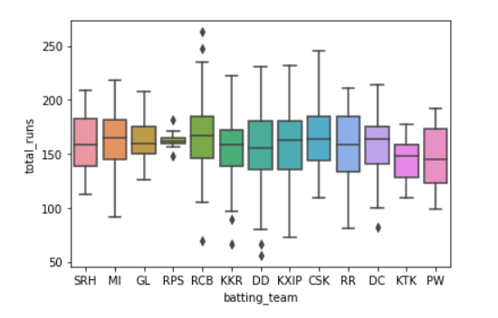

# IPL Data Analysis

## Discription
A Data analysis project based IPL dataset on Kaggle where I have analysed the performances of player throughout the tournament which includes individual runs, dissmissial against each team and also analysed the all IPL team performances against each other throghout the tournamnent. some of the plots shown below after analyzing the data:

## Plots

Types of dismissal-

Percentage of Run Scoring in Different ways like (Single, double, boundaries etc.)

Range of total First inning runs scored by each Team-

## Technologies used
Python, NumPy, Pandas, Matplotlib, Seaborn, MatplotLib
