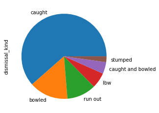
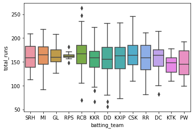
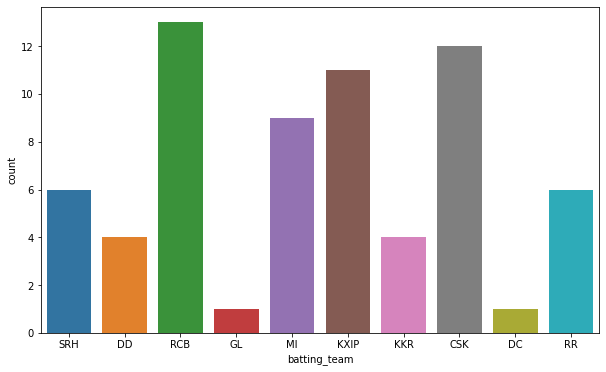
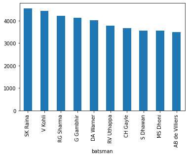

# Ipl data_analysis

## Discription
A Data analysis project based on Kaggle dataset where I have analysed the performances of player throughout the tournament regarding runs, dissmissial and all against each team and also analysed the all team performances throghout the tournamnent.

## Plots
Some of the plots shown here-

## Technologies used
Python, NumPy, Pandas, Matplotlib, Seaborn
