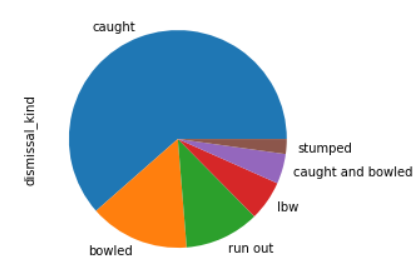
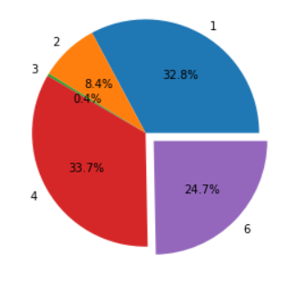

# Ipl data_analysis

## Discription
A Data analysis project based IPL dataset on Kaggle where I have analysed the performances of player throughout the tournament regarding runs, dissmissial and all against each team and also analysed the all team performances throghout the tournamnent. so after all these process some of the plots are shown below-

## Plots

Types of dismissal

Percentage of Run Scoring in Different ways like (Single, double, boundaries etc.)

Range of total First inning runs scored by each Team

## Technologies used
Python, NumPy, Pandas, Matplotlib, Seaborn, MatplotLib
